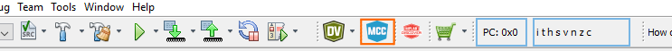
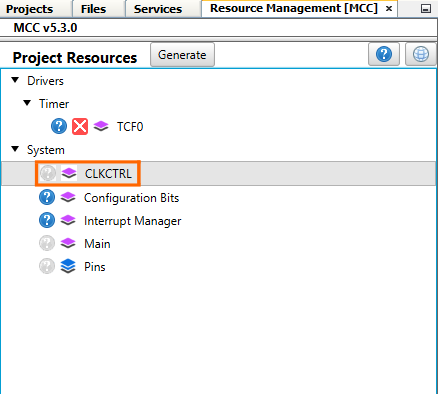
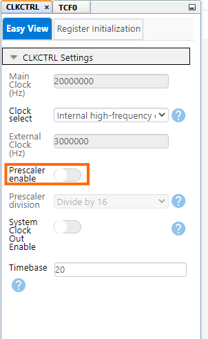
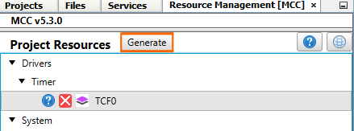

[](https://www.microchip.com)

## Generate Two Variable-Frequency Signals in NCO-Fixed Mode Using the TCF
The example shows how to set the TCF to generate two Variable-Frequency signals, ranging from 10 Hz to 100 khz, with one magnitude step change. The TCF is operating in Numerically Controlled Oscillator (NCO) mode, and has an important advantage over classical Pulse-Width Modulation (PWM) control, as it offers liniar ferquency regulation.

## Related Documentation
More details and code examples on the AVR16EB32 can be found at the following links:
- [AVR<sup>®</sup> EB Product Page](https://www.microchip.com/en-us/product/AVR16EB32)
- [AVR<sup>®</sup> EB Code Examples on GitHub](https://github.com/microchip-pic-avr-examples?q=AVR16EB32)

## Software Used
- [MPLAB® X IDE v6.15 or newer](https://www.microchip.com/en-us/tools-resources/develop/mplab-x-ide)
- [AVR-Ex DFP-2.7.184 or newer Device Pack](https://packs.download.microchip.com/)
- [MPLAB® XC8 compiler v2.45](https://www.microchip.com/en-us/tools-resources/develop/mplab-xc-compilers/downloads-documentation#XC8)
- [MPLAB® Code Configurator (MCC) v 5.3.7](https://www.microchip.com/en-us/tools-resources/configure/mplab-code-configurator)
- [MPLAB® Code Configurator (MCC) Melody Core v 2.6.2 or newer](https://www.microchip.com/en-us/tools-resources/configure/mplab-code-configurator)

## Hardware Used
- [AVR<sup>®</sup> EB Curiosity Nano](https://www.microchip.com/en-us/product/AVR16EB32)

## Setup
The AVR16EB32 Curiosity Nano Development Board is used as a test platform.
<br>

## Functionality
After the peripheral clock and the TCF are initialized, the ```NCO_Fixed_DutyCycle_Demo``` function is called in an infinite loop.

The purpose of this function is to change the frequency at which the timer operates. The timer is started with a frequency of 10 Hz and run up until it reaches 100 KHz.

At the end, the timer is stopped and the frequency is reset to 10 Hz.

```
void NCO_Fixed_DutyCycle_Demo(void)
{   
    /* Enable the TCF */
    TCF0_Start();
    
    /* Delay for 600 ms */
   _delay_ms(600);
   
   /* Load the CMP register with a frequency of 100 Hz */
   TCF0_CompareSet(TCF0_NCOFD_HZ_TO_INCREMENT(100, 20000000, 1));
   
    /* Delay for 60 ms */
   _delay_ms(60);
   
   /* Load the CMP register with a frequency of 1 KHz */
   TCF0_CompareSet(TCF0_NCOFD_HZ_TO_INCREMENT(1000, 20000000, 1));
   
    /* Delay for 6 ms */
   _delay_ms(6);
   
   /* Load the CMP register with a frequency of 10 KHz */
   TCF0_CompareSet(TCF0_NCOFD_HZ_TO_INCREMENT(10000, 20000000, 1));
   
    /* Delay for 600 us */
   _delay_us(600);
   
   /* Load the CMP register with a frequency of 100 KHz */
   TCF0_CompareSet(TCF0_NCOFD_HZ_TO_INCREMENT(100000, 20000000, 1));
   
    /* Delay for 60 us */
   _delay_us(60);
   
    /* Stop the TCF */
   TCF0_Stop();
   
   /* Load the CMP register with a frequency of 10 Hz */
   TCF0_CompareSet(TCF0_NCOFD_HZ_TO_INCREMENT(10, 20000000, 1));
}

```
<br>


<br>To generate this project using MPLAB® X IDE and the MPLAB® X Code Configurator (MCC Melody, MCC Clasic is not supported on this device), follow the next steps:

<br>1. Open MPLAB X IDE and create a new project for AVR16EB32 device.


<br>2. Open MCC from the toolbar (more information on how to install the MCC plug-in can be found [here](https://onlinedocs.microchip.com/pr/GUID-1F7007B8-9A46-4D03-AEED-650357BA760D-en-US-6/index.html?GUID-D98198EA-93B9-45D2-9D96-C97DBCA55267)).


<br>3.  In MCC Content Manager Wizard select MCC Melody then select the Finish button.<br>
<br>
<br>

<br>4.  Go to Project Resources, click System then click CLKCTRL and disable the Prescaler Enable button.
<br>
<br>

<br>5. From the Device Resources go to Drivers and click the Timer window, add the TCF module, then do the following configuration:
    <br> – Clock Divider: System clock (by default the divider should be 1 - System clock)
    <br> – Waveform Generation Mode: NCO Fixed Duty-Cycle mode
    <br> –Waveform Generation Pulse Length; 1 Clock Period
    <br> – Requested Period[s]: 0.000008
    <br> – Waveform Output n : check the boxes from the Enable column for Waveform Output 0 and Waveform Output 1

<br>
<br>
<br>
<br>


<br>6. In the Pin Grid View the PA0 and PA1 pins must be enabled by default. If not just toggle the buttons, it turns green if enabled.

<br>


<br>7. In the Project Resources window, click the Generate button so that MCC will generate all the specified drivers and configurations.
<br>
<br>
<br>
<br>


<br>8. After the MCC Melody generates the project files with the configuration explained above, edit the main.c file as explained here [(insert TB url link here)](insert TB url link here) at page 33.


## Operation
 1. Connect the board to the PC.

 2. Open the **TCF_NCO_Fixed_Duty_Cycle_MCC.X* or **TCF_NCO_Fixed_Duty_Cycle.X** solution in MPLAB X IDE.

 3. Right click on the project and select **Set as main project**.

<br>

 4. Build the **TCF_NCO_Fixed_Duty_Cycle_MCC.X** or **TCF_NCO_Fixed_Duty_Cycle.X**  project: click on **Clean and Build Project**.

<br>

 5. Program the project to the board: click on **Make and Program Device**.

<br>


## Results

The logic analyzer captures show how the TCF generates a waveform signal in NCO Fixed Duty Cycle (FDC) mode.

<br>Result 1: two identical signals are generated with a frequency of 10 Hz and duty cycle of 50%.
<br>

<br>Result 2: two identical signals are generated with a frequency of 100 Hz and duty cycle of 50%.
<br>

<br>Result 3: two identical signals are generated with a frequency of 1 kHz and duty cycle of 50%.
<br>

<br>Result 4: two identical signals are generated with a frequency of 10 kHz and duty cycle of 50%.
<br>

<br>Result 5: two identical signals are generated with a frequency of 100 kHz and duty cycle of 50%.
<br>


## Summary

This example depicted how to create a project in MCC using the TCF peripheral of AVR16EB32. The TCF was configured to generate two PWM output signals on the default TCF output pins (PA0 and PA1). The PWM sequence changes the frequency from 10 Hz to 100 KHz with one magnitude step maintaining 50% duty cycle. The measured output confirms the expected result.
