[](https://www.microchip.com)

## Use case 2: Generate Two Two Constant On-Time PWM Signals in NCO-Pulse Length Mode using the TCF

Below is an example of how to set TCF to generate Two Constant On-Time PWM Signals 

## Related Documentation
More details and code examples on the AVR16EB32 can be found at the following links:
- [TBxxxx - Getting Started with Timer/Counter Type F (TCF)](insert url link here)
- [AVR16EB32 Product Page](insert url link here)
- [AVR16EB32 Code Examples on GitHub](insert url link here)

## Software Used
- [MPLAB X IDE v6.15 or newer](https://www.microchip.com/en-us/tools-resources/develop/mplab-x-ide)
- [AVR-Ex DFP-2.5.184 or newer Device Pack](insert url link here)

## Hardware Used
- AVR16EB32 Cnano [(AVR16EB32)](insert url link here)(insert url link here)


## Functionality
After we initialize the peripheral clock and the TCF, we call in an infinite loop the NCO_Pulse_Length_Demo function.

The purpose of this function is to change the pulse length of the waveform which  the timer outputs on the pin. We first start the timer  with a pulse length of 2 clock-cycles and then run up to the maximum of 128 clock-cycles. 

At the end we stop the timer and reset the pulse length to default.

```
void NCO_Pulse_Length_Demo(void)
{
   TCF0_Start(); 
   _delay_us(20);
   TCF0_NCO_PulseLengthSet(TCF_WGPULSE_CLK2_gc);
   _delay_us(20);
   TCF0_NCO_PulseLengthSet(TCF_WGPULSE_CLK4_gc);
   _delay_us(20);
   TCF0_NCO_PulseLengthSet(TCF_WGPULSE_CLK8_gc);
   _delay_us(20);
   TCF0_NCO_PulseLengthSet(TCF_WGPULSE_CLK16_gc);
   _delay_us(20);
   TCF0_NCO_PulseLengthSet(TCF_WGPULSE_CLK32_gc);
   _delay_us(20);
   TCF0_NCO_PulseLengthSet(TCF_WGPULSE_CLK64_gc);
   _delay_us(20);
   TCF0_NCO_PulseLengthSet(TCF_WGPULSE_CLK128_gc);
   _delay_us(18);
   TCF0_Stop();
   TCF0_NCO_PulseLengthSet(TCF_WGPULSE_CLK1_gc);
}

```
<br>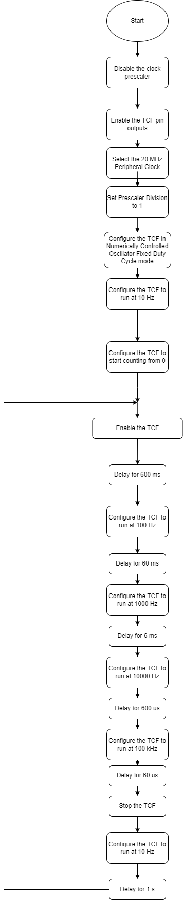

## Setup
The AVR16EB32 Cnano Development Board is used as test platform.
<br>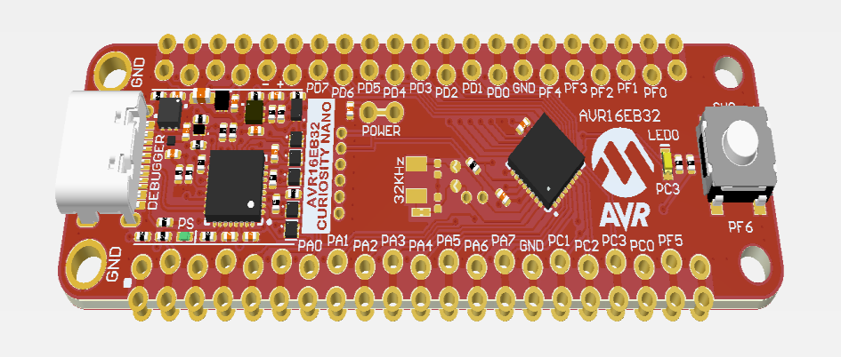

<br>To generate this project using MPLAB X IDE and the MPLAB Code Configurator (MCC Melody, MCC Clasic is not supported on this device), follow the next steps:

<br>1. Open MPLAB® X IDE and create a new project for AVR16EB32 device.
<br>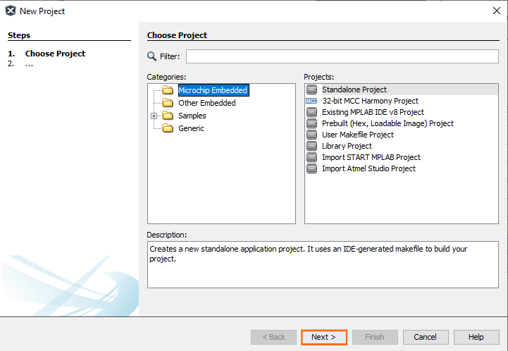
<br>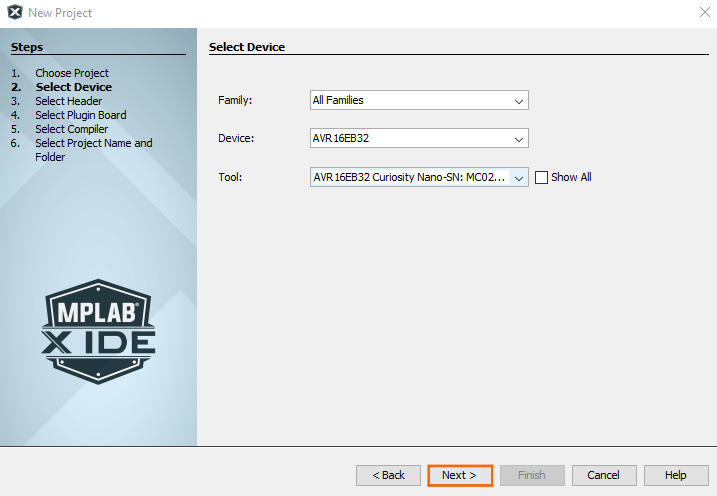
<br>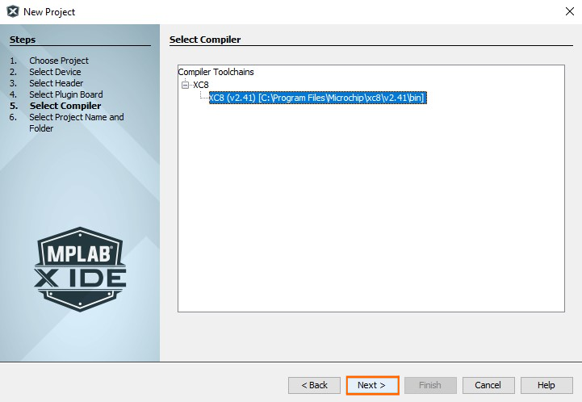
<br>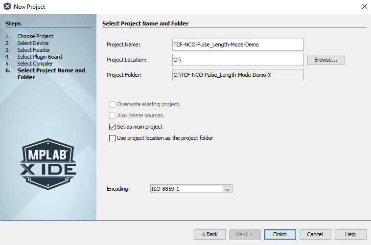


<br>2. Open MCC from the toolbar (more information on how to install the MCC plug-in can be found at [(https://onlinedocs.microchip.com/pr/GUID-1F7007B8-9A46-4D03-AEED-650357BA760D-en-US-6/index.html?GUID-D98198EA-93B9-45D2-9D96-C97DBCA55267)](https://onlinedocs.microchip.com/pr/GUID-1F7007B8-9A46-4D03-AEED-650357BA760D-en-US-6/index.html?GUID-D98198EA-93B9-45D2-9D96-C97DBCA55267)).


<br>3.  In MCC Content Manager Wizard select MCC Melody then select the Finish button.<br>
<br>
<br>

<br>4.  Go to Project Resources, click System then click CLKCTRL and disable the Prescaler enable button.
<br>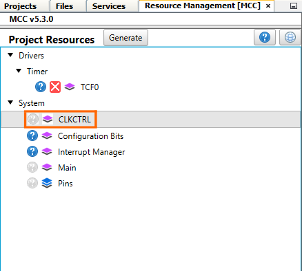
<br>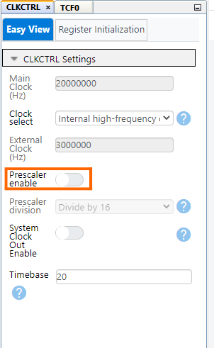

<br>5. From the Device Resources go to Drivers and click the Timer window, add the TCF module, then do the following configuration:
    <br> – Clock Divider: System clock (by default the divider should be 1 - System clock)
    <br> – Waveform Generation Mode: NCO Pulse-Length mode
    <br> – Waveform Generation Pulse Length: 1 Clock Period
    <br> – Requested Period[s]: 0.000008
    <br> – Waveform Output n : check the boxes from the Enable column for Waveform Output 0 and Waveform Output 1

<br>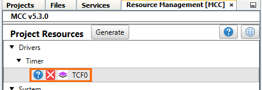
<br>
<br>
<br>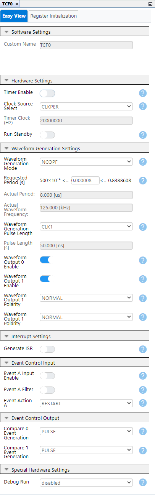


<br>6. In the Pin Grid View the PA0 and PA1 pins must be enabled by default. If not just toggle the buttons, it turns green if enabled.

<br>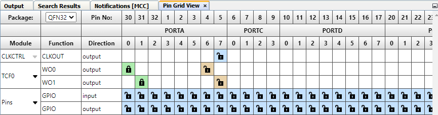


<br>7. In the Project Resources window, click the Generate button so that MCC will generate all the specified drivers and configurations.
<br>
<br>
<br>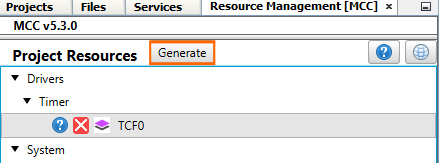
<br>


<br>8. After the MCC Melody generates the project files with the configuration explained above, edit the main.c file as explained here [(insert TB url link here)](insert TB url link here) at page 33.


## Operation
 1. Connect the board to the PC.

 2. Open the **TCF_NCO_Fixed_Duty_Cycle_MCC.X* or **TCF_NCO_Fixed_Duty_Cycle.X** solution in MPLAB X IDE.

 3. Right click on the project and select **Set as main project**.

<br>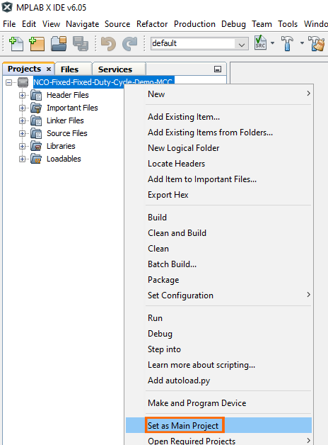

 4. Build the **TCF_NCO_Fixed_Duty_Cycle_MCC.X** or **TCF_NCO_Fixed_Duty_Cycle.X**  project: click on **Clean and Build Project**.

<br>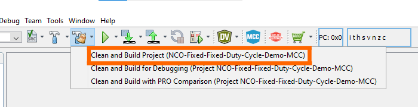

 5. Program the project to the board: click on **Make and Program Device**.

<br>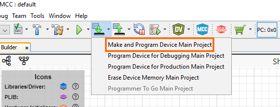


## Results

Below is illustrated a logic analyzer capture, to help understanding a little bit better how the TCF generates a waveform signal in NCO Pulse-Length mode.

<br>Result: TCF is used to generate two output signals with a frequnecy of 125 kHz and pulse-wdth-modulated with a variable duration ranging from 1 clock-cycle up to 128 clock-cycles.
In this case one clock-cycle takes 50 ns.
<br>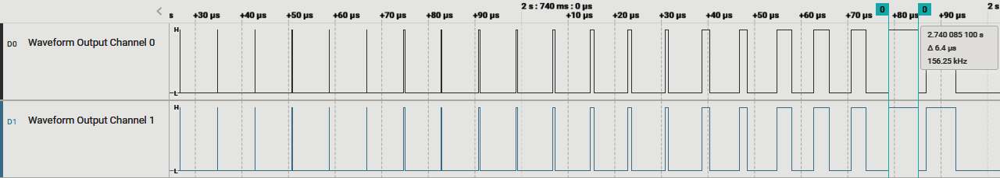


## Summary

This example depicted how to create a project in MCC using the TCF peripheral of ARVR16EB32. The TCF was configured to generate two PWM output signals on the default TCF output pins. The pulse length varies between 1 clock-cycle and 128 clock-cylces.The measured output confirms the expected result.